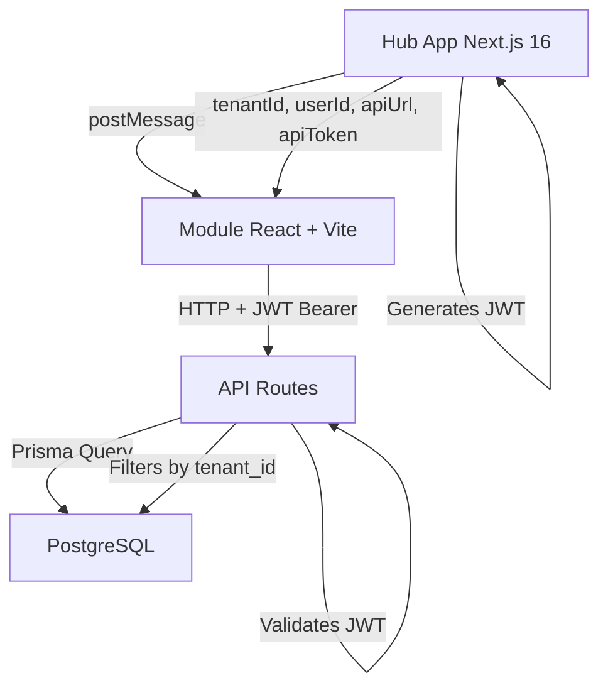

<div align="center">

# 🚀 Hub.app Modules DevKit

**Complete development kit for creating Hub.app modules**

[](https://opensource.org/licenses/MIT)
[](https://github.com/e4labs-bcm/hub-modules-devkit/releases)
[](https://www.typescriptlang.org/)
[](https://reactjs.org/)
[](https://nextjs.org/)
[](CONTRIBUTING.md)

[Quick Start](#-quick-start) • [Documentation](#-documentation) • [Examples](#-examples) • [Contributing](CONTRIBUTING.md)

---

### ⚡ Create production-ready Hub.app modules in **5 minutes**

</div>

---

## 📊 Stats at a Glance

<table>
<tr>
<td align="center">
<strong>📦 Templates</strong><br>
4 production-ready<br>
TypeScript files
</td>
<td align="center">
<strong>🛠️ Scripts</strong><br>
2 automation scripts<br>
850 lines of code
</td>
<td align="center">
<strong>📚 Docs</strong><br>
6 complete guides<br>
80+ pages
</td>
<td align="center">
<strong>⚡ Setup Time</strong><br>
~5 minutes<br>
from zero to deploy
</td>
</tr>
</table>

---

## ✨ Features

<table>
<tr>
<td width="50%">

### 🔒 Security First
- ✅ JWT authentication by default
- ✅ Multi-tenant isolation (tenant_id filtering)
- ✅ CORS configured
- ✅ LGPD compliance (created_by tracking)

### ⚡ Zero Configuration
- ✅ Full TypeScript templates
- ✅ Radix UI + Tailwind CSS
- ✅ Vite + React 18 pre-configured
- ✅ API Routes auto-generated

</td>
<td width="50%">

### 🚀 Production Ready
- ✅ Hot reload (dev server)
- ✅ Optimized builds (Vite)
- ✅ Deploy to any CDN
- ✅ Real-time ready (SSE support)

### 🤖 Claude Code Optimized
- ✅ Complete integration guide
- ✅ Workflow recommendations
- ✅ Useful commands
- ✅ Code patterns

</td>
</tr>
</table>

---

## 🎯 What is Hub.app Modules DevKit?

A **complete development kit** to create independent modules that integrate seamlessly with Hub.app.

### What is a Hub.app Module?

A **standalone React application** that runs inside Hub.app via iframe and communicates with the backend through JWT-authenticated API Routes.

### Why use this DevKit?

<table>
<tr>
<th>Without DevKit ❌</th>
<th>With DevKit ✅</th>
</tr>
<tr>
<td>

- ⏱️ **8-12 hours** to setup
- ⚙️ Manual configuration
- 🐛 High error rate
- 📝 No standardization
- 🔓 Security as afterthought

</td>
<td>

- ⚡ **5 minutes** to setup
- 🤖 Full automation
- ✅ Zero configuration errors
- 📦 Standardized architecture
- 🔒 Secure by default

</td>
</tr>
<tr>
<td align="center" colspan="2">

### **Result: 95% time saved!** 🚀

</td>
</tr>
</table>

---

## ⚡ Quick Start

### Prerequisites

- Node.js 18+
- PostgreSQL
- Hub.app Next.js (running)

### Create Your First Module (3 commands, 5 minutes)

```bash
# 1. Create module structure
cd hub-modules-devkit
./scripts/create-module.sh tasks "Tasks" ListTodo

# 2. Install in Hub.app
cd ../hub-app-nextjs
./scripts/install-module.sh tasks "Tasks" ListTodo

# 3. Start dev server
cd packages/mod-tasks
npm run dev  # http://localhost:5173
```

**Done!** 🎉 Your module is running at http://localhost:3000

---

## 🏗️ Architecture

### Data Flow



### Visual Architecture

```
┌─────────────────────────────────────────────────┐
│  Hub App (localhost:3000)                       │
│  • Manages authentication (Auth.js)             │
│  • Generates JWT token                          │
│  • Loads modules via iframe                     │
└─────────────────────────────────────────────────┘
                     │
                     │ postMessage
                     │ { tenantId, userId, apiUrl, apiToken }
                     ▼
┌─────────────────────────────────────────────────┐
│  Module (React + Vite - iframe)                 │
│  • Receives config via postMessage              │
│  • Configures apiAdapter with JWT token         │
│  • Makes authenticated requests                 │
└─────────────────────────────────────────────────┘
                     │
                     │ HTTP + Bearer token
                     ▼
┌─────────────────────────────────────────────────┐
│  API Routes (/api/modules/[name]/*)             │
│  • Validates JWT token                          │
│  • Extracts tenantId from token                 │
│  • Executes Prisma queries                      │
│  • Returns tenant-filtered data                 │
└─────────────────────────────────────────────────┘
                     │
                     ▼
┌─────────────────────────────────────────────────┐
│  PostgreSQL                                     │
│  • All tables have tenant_id                    │
│  • Triggers for real-time (NOTIFY/LISTEN)       │
└─────────────────────────────────────────────────┘
```

---

## 📁 Module Structure

```
packages/mod-tasks/
├── adapter/
│   └── apiAdapter.ts              # HTTP client with JWT
│
├── app/
│   ├── src/
│   │   ├── App.tsx                # Main component
│   │   ├── main.tsx               # Entry point
│   │   ├── hubContext.ts          # Hub integration
│   │   ├── components/            # React components
│   │   ├── types/                 # TypeScript types
│   │   └── utils/                 # Utilities
│   ├── vite.config.ts
│   └── index.html
│
├── migrations/
│   └── YYYYMMDD_tasks.sql         # SQL migration
│
├── manifest.json                  # Module metadata
├── package.json                   # Dependencies
└── README.md                      # Documentation
```

---

## 📚 Documentation

<table>
<tr>
<td width="33%">

### 📖 [README.md](README.md)
Complete architecture and integration guide

**When to read:** First time using

</td>
<td width="33%">

### ⚡ [QUICK_START.md](QUICK_START.md)
5-minute quick start guide

**When to read:** Creating a module

</td>
<td width="33%">

### 🛠️ [INSTALL.md](INSTALL.md)
Installation and setup

**When to read:** First installation

</td>
</tr>
<tr>
<td width="33%">

### 🤖 [CLAUDE_CODE_GUIDE.md](docs/CLAUDE_CODE_GUIDE.md)
Complete guide for Claude Code

**When to read:** Using Claude Code

</td>
<td width="33%">

### 📝 [SUMMARY.md](SUMMARY.md)
Executive summary

**When to read:** Quick overview

</td>
<td width="33%">

### 🤝 [CONTRIBUTING.md](CONTRIBUTING.md)
Contribution guidelines

**When to read:** Contributing

</td>
</tr>
</table>

---

## 🛠️ Scripts

### create-module.sh

Creates complete module structure with all templates.

```bash
./scripts/create-module.sh <slug> "<Title>" [Icon]
```

**Example:**
```bash
./scripts/create-module.sh tasks "Tasks" ListTodo
./scripts/create-module.sh inventory "Inventory" Package
./scripts/create-module.sh crm "CRM" Users
```

**What it does:**
- ✅ Creates directory structure
- ✅ Copies and configures templates
- ✅ Generates SQL migration
- ✅ Installs dependencies
- ✅ Creates documentation

---

### install-module.sh

Installs module in Hub.app (database + API routes + Prisma).

```bash
cd hub-app-nextjs
./scripts/install-module.sh <slug> "<Title>" <Icon> [tenant-id]
```

**Example:**
```bash
./scripts/install-module.sh tasks "Tasks" ListTodo
```

**What it does:**
- ✅ Applies SQL migration
- ✅ Registers in `modulos_instalados` table
- ✅ Creates API routes
- ✅ Updates Prisma schema
- ✅ Regenerates Prisma Client

---

## 🎨 Examples

### Example 1: Tasks Module (TODO List)

```bash
./scripts/create-module.sh tasks "Tasks" ListTodo
cd ../hub-app-nextjs
./scripts/install-module.sh tasks "Tasks" ListTodo
```

**Result:** Complete CRUD for tasks with multi-tenant support

### Example 2: Inventory Module

```bash
./scripts/create-module.sh inventory "Inventory" Package
cd ../hub-app-nextjs
./scripts/install-module.sh inventory "Inventory" Package
```

**Result:** Inventory management with categories and stock control

### Example 3: CRM Module

```bash
./scripts/create-module.sh crm "CRM" Users
cd ../hub-app-nextjs
./scripts/install-module.sh crm "CRM" Users
```

**Result:** Customer relationship management with contacts and deals

---

## 🚀 Deploy to Production

### 1. Build

```bash
cd packages/mod-tasks
npm run build
```

### 2. Deploy to CDN

**Vercel:**
```bash
vercel --prod
```

**Netlify:**
```bash
netlify deploy --prod --dir=dist
```

**Custom Server:**
```bash
rsync -avz dist/ user@server:/var/www/tasks/
```

### 3. Update manifest

```sql
UPDATE modulos_instalados
SET manifest = jsonb_set(manifest, '{url}', '"https://tasks.vercel.app/"')
WHERE nome = 'Tasks';
```

---

## 🔒 Security Best Practices

### ⚠️ ALWAYS validate JWT

```typescript
// ❌ WRONG - No authentication
export async function GET(req: NextRequest) {
  const items = await prisma.items.findMany();
  return Response.json(items);
}

// ✅ CORRECT - JWT validated
export async function GET(req: NextRequest) {
  const { tenantId } = await authenticateModule(req);
  const items = await prisma.items.findMany({
    where: { tenant_id: tenantId }
  });
  return apiResponse(items);
}
```

### ⚠️ NEVER trust request body for tenant_id

```typescript
// ❌ DANGER - User can pass any tenant_id
const body = await req.json();
const items = await prisma.items.findMany({
  where: { tenant_id: body.tenantId }  // ⚠️ NEVER DO THIS
});

// ✅ SAFE - Always extract from JWT
const { tenantId } = await authenticateModule(req);
const items = await prisma.items.findMany({
  where: { tenant_id: tenantId }  // ✅ Secure
});
```

---

## 🐛 Troubleshooting

<details>
<summary><strong>Module doesn't load (blank screen)</strong></summary>

**Cause:** CORS or incorrect URL

**Solution:**
1. Check manifest.json → correct URL?
2. Module running? (`npm run dev`)
3. CORS configured in OPTIONS? (already in template)

</details>

<details>
<summary><strong>API returns 401 Unauthorized</strong></summary>

**Cause:** Invalid or expired JWT token

**Solution:**
```javascript
// Check in browser console:
// Should show:
✅ [tasks] API adapter configured!

// If not, postMessage was not received
```

</details>

<details>
<summary><strong>Data from other tenants appearing</strong></summary>

**Cause:** Query not filtering by tenant_id

**Solution:**
```typescript
// ❌ WRONG
const items = await prisma.items.findMany();

// ✅ CORRECT
const items = await prisma.items.findMany({
  where: { tenant_id: tenantId }  // from JWT!
});
```

</details>

---

## 🤝 Contributing

We welcome contributions! Please see [CONTRIBUTING.md](CONTRIBUTING.md) for guidelines.

### Areas that need help:

- 📦 Complete examples (tasks, inventory, CRM)
- 🧪 Automated tests
- 🪟 Windows/WSL support
- 🌐 English translation
- 📹 Video tutorials

---

## 📊 Project Stats

<div align="center">

| Metric | Value |
|--------|-------|
| **Size** | 120 KB |
| **Lines of Code** | 3,716 |
| **Documentation Pages** | 80+ |
| **Templates** | 4 |
| **Scripts** | 2 |
| **Time Saved** | 95% |

</div>

---

## 🏆 Contributors

<div align="center">

**Developed with ❤️ by:**

<table>
<tr>
<td align="center">
<br>
<sub><b>Bem Comum Labs</b></sub>
</td>
<td align="center">
<br>
<sub><b>Claude (Anthropic)</b></sub>
</td>
</tr>
</table>

**Special thanks to all contributors who help improve this project!**

[Become a contributor](CONTRIBUTING.md)

</div>

---

## 📜 License

This project is licensed under the MIT License - see the [LICENSE](LICENSE) file for details.

---

## 🔗 Links

- **Repository:** https://github.com/e4labs-bcm/hub-modules-devkit
- **Documentation:** [docs/](docs/)
- **Issues:** https://github.com/e4labs-bcm/hub-modules-devkit/issues
- **Hub.app:** https://meuhub.app

---

<div align="center">

### ⭐ If this helped you, consider giving it a star!

**Made with 🤖 [Claude Code](https://claude.com/claude-code)**

</div>
